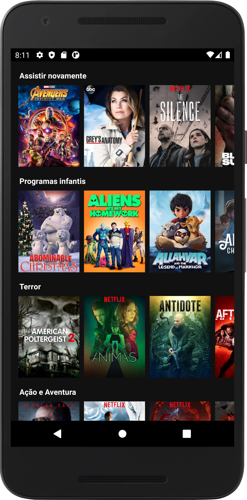
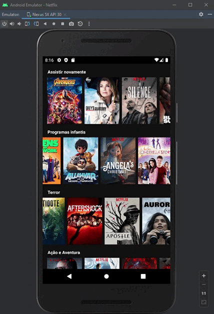
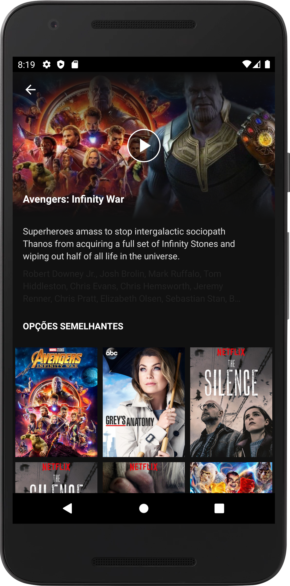
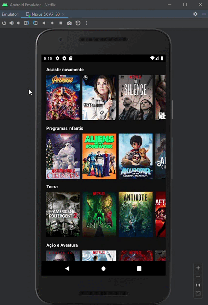

<h1>Netflix - Kotlin</h1>
 

Refazendo o aplicativo da Netflix

  
<a href="https://drive.google.com/file/d/1nfSbRg1BQCtFrNBMpAXZX2CgoGAeolPg/view?usp=sharing">Download do aplicativo</a>

 
<h2>Listagem de filmes</h2>
 

 

   
<h2>Tela de detalhes do filme</h2>
 

 

